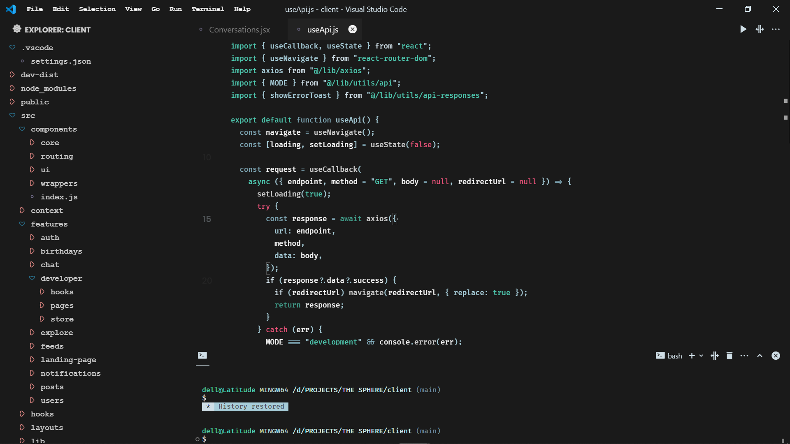

### Eight8May Theme

A minimal poimandres based VS Code theme with a clean UI and soft contrast.
Designed for developers who love simplicity and calm colors.

## Screenshot

## 

---

## 🔧 Custom VS Code UI Enhancements Included

### 📥 Download Custom CSS + Script

- [Download Custom VS Code CSS](src/custom/custom-css.css)
- [Download Custom VS Code Script](src/custom/custom-script.js)

---

## 🚀 How to Use Custom VS Code Theme Enhancements

1. Install **Custom CSS and JS Loader** extension.
2. Copy the files from this repo:
3. Add the following to your `settings.json`:

```json
"vscode_custom_css.imports": [
  //path e.g
  "file:///C:/custom-vscode/custom-css.css",
  "file:///C:/custom-vscode/custom-script.js",

],
```

4. Ctrl + Shift + P → Enable Custom CSS and JS

## 🗽For better experience copy this settings.json into yours

[Open settings](src/custom/settings.json)
[Download settings.json](src/custom/settings.json)

**Enjoy!**
